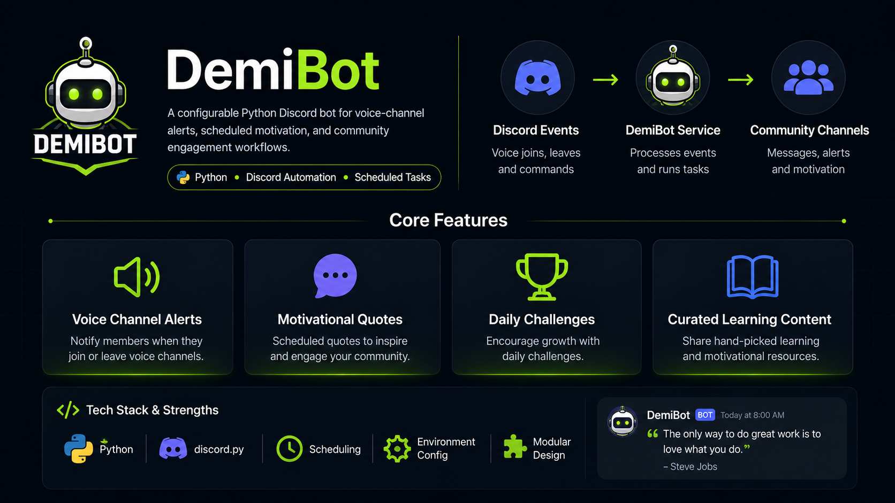

# DemiBot

A configurable Python Discord bot for voice-channel activity alerts, scheduled motivation, challenges, and community engagement workflows.

<p align="center">
  
</p>

> DemiBot processes Discord events and scheduled tasks to deliver voice-channel alerts, motivation, challenges, and curated learning content.

## Overview

Discord communities often need lightweight automation for engagement, reminders, and visibility—without requiring moderators to post manually throughout the day. DemiBot listens for voice activity, delivers scheduled motivational content on a weekly rhythm, and exposes on-demand commands for quotes, challenges, clips, and curated learning posts.

## Core Features

- **Voice channel join alerts** — posts when a member joins a voice channel (toggleable via `!togglealerts`)
- **Scheduled content** — posts at **8:30 AM** and **8:00 PM** Eastern Time on a defined weekly schedule
- **Motivational quotes** — curated JSON dataset with author attribution (`!quote`)
- **Daily challenges** — actionable prompts (`!challenge`)
- **Clips and videos** — YouTube links for motivational media (`!clip`)
- **Daily learning** — summaries, lessons, actions, and reference links (`!learn`)
- **Mixed motivation** — shuffled content from all pools (`!motivate`)
- **Configurable channels** — voice-alert and motivation destinations via environment variables
- **Content rotation** — shuffled no-repeat cycling per content type, persisted in `data/state.json`
- **Admin controls** — `!resetcontentstate` (administrator permission required)
- **Heroku-ready worker** — `Procfile` runs `python bot.py`

## Engineering Highlights

- **Python 3.11+** with **discord.py 2.3.2** (`commands.Bot`, event listeners, background tasks)
- **Event-driven architecture** — `on_voice_state_update`, `on_ready`, and prefix commands
- **Scheduled jobs** — `discord.ext.tasks` loop checks America/New_York time each minute
- **Structured content** — JSON datasets for quotes, challenges, clips, custom messages, and daily learning
- **Environment-based configuration** — `python-dotenv` loads secrets and channel IDs from `.env`
- **Persistent rotation state** — `data/state.json` tracks shuffled index order per content pool
- **Graceful data loading** — missing or invalid JSON files log a warning and return empty pools

## Architecture

```
Discord Events / Scheduled Jobs
        ↓
DemiBot Python Service (bot.py)
        ↓
Configuration (.env) + Content JSON + Rotation State (data/state.json)
        ↓
Discord API → Configured Channels
```

**Weekly schedule (8:30 AM / 8:00 PM ET):**

| Day | Morning | Evening |
|-----|---------|---------|
| Monday | Quote | Challenge |
| Tuesday | Daily Learning | Clip |
| Wednesday | Quote | Grind Reminder |
| Thursday | Daily Learning | Challenge |
| Friday | Quote | Clip |
| Saturday | Daily Learning | Grind Reminder |
| Sunday | Daily Learning | Quote |

## Local Setup

```bash
# Clone the repository
git clone https://github.com/YOUR_USERNAME/DemiBot.git
cd DemiBot

# Create and activate a virtual environment
python3 -m venv venv
source venv/bin/activate        # macOS / Linux
# venv\Scripts\activate         # Windows

# Install dependencies
pip install -r requirements.txt

# Configure environment
cp .env.example .env
# Edit .env with your Discord bot token and channel IDs

# Run the bot
python bot.py
```

## Configuration

| Variable | Required | Type | Description |
|----------|----------|------|-------------|
| `DISCORD_TOKEN` | **Yes** | **Secret** | Discord bot token from the [Developer Portal](https://discord.com/developers/applications). **Never commit this.** |
| `VOICE_ALERT_CHANNEL_ID` | **Yes** | Configuration | Channel ID for voice join alerts |
| `MOTIVATION_CHANNEL_ID` | **Yes** | Configuration | Channel ID for scheduled and on-demand motivation posts |
| `TESTING_CHANNEL_ID` | No | Configuration | Reserved for future local/testing use (not wired in current code) |

**Secrets vs. configuration**

- **Secrets** (`DISCORD_TOKEN`) authenticate your bot. Treat them like passwords. Rotate immediately if exposed.
- **Configuration** (channel IDs) are not secret, but they point to your server. Use placeholders in documentation and keep production IDs in `.env` only.

**Discord intents:** Enable **Message Content Intent** in the Developer Portal if you use prefix commands.

## Commands

| Command | Description |
|---------|-------------|
| `!helpme` | List commands and weekly schedule |
| `!motivate` | Next item from the mixed content pool |
| `!quote` | Next motivational quote |
| `!challenge` | Next challenge |
| `!clip` | Next clip or video |
| `!learn` | Next daily learning post |
| `!togglealerts` | Toggle voice join alerts |
| `!togglemotivation` | Toggle scheduled posts |
| `!resetcontentstate` | Reset content rotation state (admin only) |

## Project Structure

```
.
├── bot.py                  # Main bot application
├── main.py                 # Legacy entry point (commented out)
├── requirements.txt        # Python dependencies
├── Procfile                # Heroku worker process
├── .env.example            # Environment variable template
├── quotes.json             # Quote content pool
├── challenges.json         # Challenge content pool
├── clips.json              # Clip and video content pool
├── custom_messages.json    # Grind reminder messages
├── builders.json           # Builder profiles (content library, not yet wired to bot)
├── facts.json              # Facts dataset (not yet wired to bot)
├── historical_figures.json # Historical figures (not yet wired to bot)
├── reading_excerpts.json   # Legacy reading excerpts (superseded by daily_learning)
└── data/
    ├── daily_learning.json # Curated learning posts with lessons and actions
    ├── state.example.json  # Example rotation state schema
    └── state.json          # Runtime rotation state (gitignored)
```

## Engineering Decisions

1. **Event-driven + scheduled tasks** — voice alerts react to Discord gateway events; motivation uses a lightweight minute loop instead of an external cron service.
2. **Content/data separation** — motivational copy lives in JSON files so non-code updates do not require redeploying logic.
3. **Shuffled no-repeat rotation** — each pool cycles through all items before reshuffling, avoiding immediate repeats while keeping selection simple.
4. **Environment-first secrets** — bot token and channel IDs load from `.env`; no hardcoded credentials in source.
5. **Defensive JSON loading** — missing content files degrade to empty pools with console warnings instead of crashing startup.

## Roadmap

- Wire additional content libraries (`builders.json`, `facts.json`, `historical_figures.json`) into commands
- Per-server configuration instead of single-channel environment variables
- Database-backed settings and analytics
- Automated test suite for content loading and rotation logic
- Health checks and structured logging / observability
- `TESTING_CHANNEL_ID` support for safe local development

## Screenshots / Demo

> **Placeholder** — add screenshots before sharing with recruiters.

Recommended captures:

1. **Voice-channel alert** — a `"{username} Joined VC"` message in your alert channel
2. **Scheduled motivational message** — a morning quote or evening challenge post
3. **Daily learning post** — a `!learn` response showing summary, lesson, action, and link
4. **Bot online / command response** — `!helpme` output or bot visible online in the member list

Store images in a repo folder such as `docs/images/` and link them here.

## Deployment

Heroku (worker dyno):

```bash
heroku create your-app-name
heroku config:set DISCORD_TOKEN=your_token
heroku config:set VOICE_ALERT_CHANNEL_ID=your_channel_id
heroku config:set MOTIVATION_CHANNEL_ID=your_channel_id
git push heroku main
```

The included `Procfile` runs:

```
worker: python bot.py
```

## License

© 2026 Reginald Key'Shawn Billups. All rights reserved. The source code is publicly viewable for portfolio and evaluation purposes. No permission is granted to copy, redistribute, or use this project commercially without written permission.
